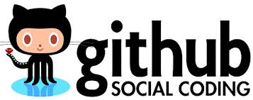
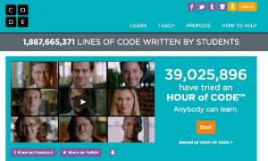
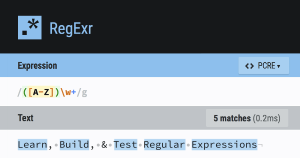
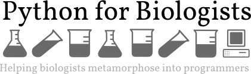

## Version Control and git

*  This page lists more information on git and version control and git-specific resources.

## General tutorials

*  Much like this course, [The Carpentries'](https://carpentries.org/) mission is "to teach foundational computational and data science skills to researchers." All of their lessons are posted and free to use. I highly recommend checking out the resources available at [carpentries.org](https://carpentries.org/).
*  [Code.org has some great tutorials](https://code.org/)

## Bash and Linux

* [A Data Cleaner's Cookbook](https://www.datafix.com.au/cookbook/)
* [BASHing data (blog)](https://www.datafix.com.au/cookbook/)
*  RegExOne has some great examples on writing regular expressions.
*  Interactive RegEx site.

## Python

* 
* [Python Data Science Handbook](https://jakevdp.github.io/PythonDataScienceHandbook/): We will look at some of the chapters of this text in the class, but this is a great book if you want to continue learning Python and data science.

## AI/ML/DL

* [NVIDIA Deep Learning Institute](https://www.nvidia.com/en-us/deep-learning-ai/education/) has many good courses
  * Ask Matt for a code for free access to the courses that have a cost